# qrkit

<p align="center">
  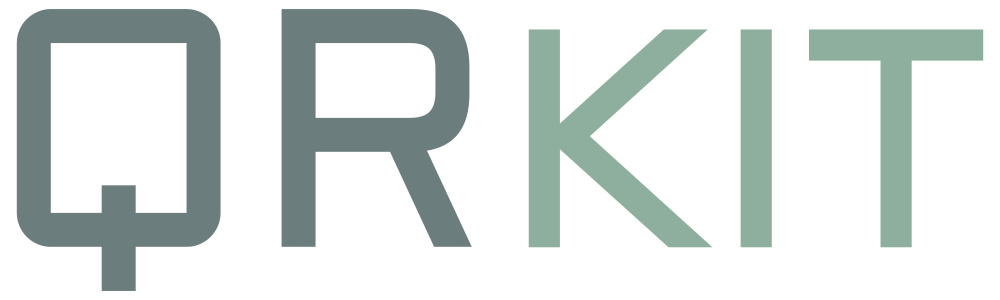
</p>

[](https://pkg.go.dev/github.com/mohamedation/qrkit)
[](LICENSE)

A **zero-dependency** QR code generator for Go with rich styling: custom module
shapes, colours, transparent backgrounds, styled finder eyes and centre logos.
Output as PNG (`image.Image`) or resolution-independent SVG.

Everything, including the Reed-Solomon error correction, matrix construction and
rasteriser, is implemented from scratch on top of the Go standard library. The
`go.mod` has no `require` lines.

<p align="center">
  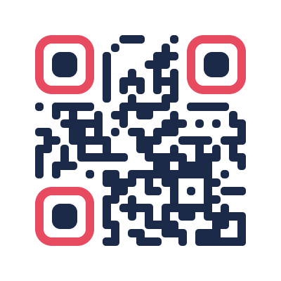
  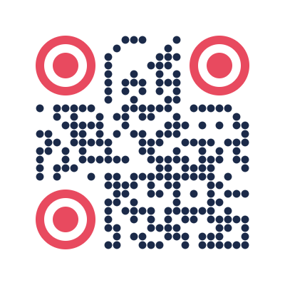
  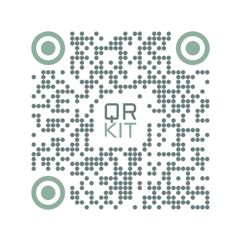
  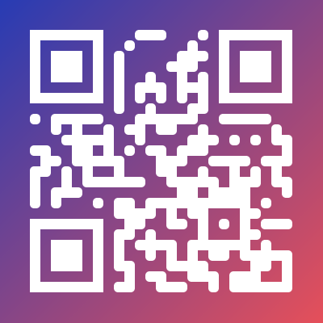
</p>

## Features

- **Standards-compliant** QR Code Model 2 encoder (ISO/IEC 18004): versions 1-40,
  error-correction levels L / M / Q / H, automatic numeric / alphanumeric / byte
  mode selection, automatic mask selection with the standard's penalty rules.
- **Shapes**: square, rounded (merging "liquid" corners), circle, diamond,
  vertical bars, horizontal bars, plus a module scale for gapped styles.
- **Finder ("eye") styling**: square, rounded, circle or module-by-module, with
  independent outer/inner colours.
- **Colours**: any foreground and background `color.Color`, including semi-transparent.
- **Transparent background** support in both PNG and SVG.
- **Logo in the centre**: any `image.Image`, with square / rounded / circle clipping,
  an optional backing plate, and a **safety check** that guarantees the logo stays
  within the code's error-correction budget (bumping the version when needed).
- **PNG and SVG** output, anti-aliased, with exact pixel sizing.
- **Library-friendly**: small functional-options API, sentinel errors for `errors.Is`,
  immutable and goroutine-safe results, no global state, no `init` side effects.
- A handy **CLI** (`cmd/qrkit`).

## Install

```sh
go get github.com/mohamedation/qrkit
```

Requires Go 1.21 or newer.

## Quick start

```go
package main

import (
	"log"

	"github.com/mohamedation/qrkit"
)

func main() {
	qr, err := qrkit.New("https://q.mohamedation.com")
	if err != nil {
		log.Fatal(err)
	}
	if err := qr.Save("code.png"); err != nil { // ".svg" works too
		log.Fatal(err)
	}
}
```

Other ways to get the result:

```go
img := qr.Image()          // image.Image (*image.NRGBA) - draw it, resize it, embed it
data, err := qr.PNG()      // []byte
err = qr.WritePNG(w)       // any io.Writer, e.g. an http.ResponseWriter
svg, err := qr.SVG()       // string
err = qr.WriteSVG(w)
grid := qr.Matrix()        // [][]bool, render it however you like
```

Serving a code over HTTP:

```go
http.HandleFunc("/qr", func(w http.ResponseWriter, r *http.Request) {
	qr, err := qrkit.New(r.URL.Query().Get("text"), qrkit.WithSize(300))
	if err != nil {
		http.Error(w, err.Error(), http.StatusBadRequest)
		return
	}
	w.Header().Set("Content-Type", "image/png")
	_ = qr.WritePNG(w)
})
```

## Styling

```go
qr, err := qrkit.New("https://q.mohamedation.com",
	qrkit.WithSize(600),
	qrkit.WithForeground(color.NRGBA{0x1b, 0x2a, 0x49, 0xff}),
	qrkit.WithTransparentBackground(),
	qrkit.WithModuleShape(qrkit.ShapeRounded),
	qrkit.WithFinderStyle(qrkit.FinderStyle{
		Shape:      qrkit.FinderRounded,
		OuterColor: color.NRGBA{0xe8, 0x4a, 0x5f, 0xff},
		InnerColor: color.NRGBA{0x1b, 0x2a, 0x49, 0xff},
	}),
)
```

| Shape option | Result |
|---|---|
| `ShapeSquare` (default) | 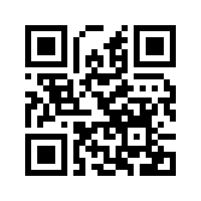 |
| `ShapeRounded` |  |
| `ShapeCircle` + `WithModuleScale(0.9)` |  |
| `ShapeDiamond` | 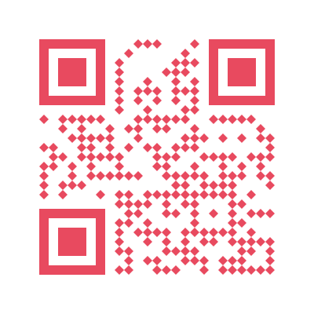 |
| `ShapeVerticalBars` | 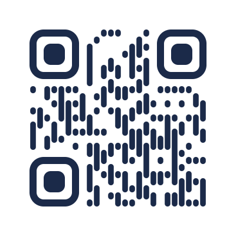 |
| `ShapeHorizontalBars` | 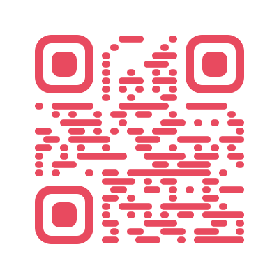 |
| `ShapeRounded` + `WithModuleScale(0.8)` |  |

### Transparent backgrounds

`WithTransparentBackground()` (or any colour with alpha < 255 via `WithBackground`)
produces a PNG with real alpha and an SVG without a background rectangle, so the
code can be laid over photos, gradients or coloured packaging:


Remember that scanners need **contrast**: dark modules on a light area, or, with
most modern scanners, light modules on a dark area.

### Logos

```go
f, _ := os.Open("logo.png")
logo, _, _ := image.Decode(f) // import _ "image/png" (and/or image/jpeg)

qr, err := qrkit.New("https://q.mohamedation.com",
	qrkit.WithLogo(logo,
		qrkit.LogoScale(0.22),               // logo's longer side, as a fraction of the code width
		qrkit.LogoPadding(1),                // empty margin around it, in modules
		qrkit.LogoClip(qrkit.LogoCircle),    // LogoSquare | LogoRounded | LogoCircle
		qrkit.LogoPlate(color.White),        // optional solid plate behind the logo
	),
)
if errors.Is(err, qrkit.ErrLogoTooLarge) {
	// reduce LogoScale, or shorten the content
}
```

<p>
  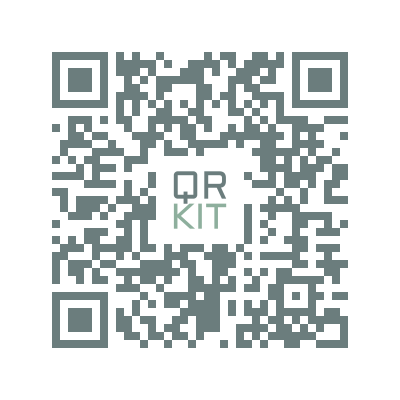
  
  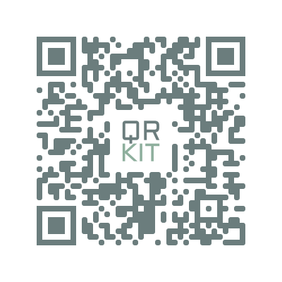
</p>

**How logo safety works.** The modules under the logo are removed, and the code
relies on error correction to recover the missing data. qrkit therefore

1. defaults to recovery level **H** when a logo is set (override with
   `WithRecoveryLevel`),
2. works out exactly which data codewords the logo destroys and checks, **for every
   Reed-Solomon block**, that the loss stays within 60% of that block's correction
   capacity,
3. refuses (returns `ErrLogoTooLarge`) if the logo would touch a finder, timing or
   format pattern, and
4. **automatically picks a larger version** if the smallest one cannot hold your logo
   safely. Short content with a logo therefore yields a bigger, denser code.

`LogoAllowUnsafe()` disables the budget check (never the structural check) if you
insist on a bigger logo. Always test such a code with real devices.

Tips: keep logos simple and high-contrast, at `LogoScale` ≈ 0.15-0.25, and prefer
shorter content: fewer bytes means a lower version, larger modules, and more room
for the logo.

## Options reference

| Option | Default | Description |
|---|---|---|
| `WithRecoveryLevel(l)` | `LevelMedium` (`LevelHigh` with a logo) | `LevelLow` ≈7%, `LevelMedium` ≈15%, `LevelQuartile` ≈25%, `LevelHigh` ≈30% |
| `WithVersion(v)` / `WithVersionRange(min,max)` | 1-40 | Force or bound the symbol version |
| `WithMask(m)` | auto (-1) | Force mask pattern 0-7 |
| `WithQuietZone(n)` | 4 | Border in modules (the standard requires 4) |
| `WithSize(px)` | 512 | Image is exactly `px`×`px`; modules get the largest whole pixel size that fits and the remainder widens the quiet zone |
| `WithModuleSize(px)` | | Pixels per module instead of a total size (last of the two wins) |
| `WithForeground(c)` | black | Dark module colour |
| `WithBackground(c)` | white | Background; may be translucent |
| `WithTransparentBackground()` | | Fully transparent background |
| `WithModuleShape(s)` | `ShapeSquare` | See shapes above |
| `WithModuleScale(f)` | 1 | Module size inside its cell, in (0, 1] |
| `WithCornerRadius(f)` | 0.4 | Corner radius for `ShapeRounded`, in [0, 0.5] |
| `WithFinderStyle(s)` | square, foreground | Eye shape (`FinderSquare/Rounded/Circle/Modules`) and colours |
| `WithLogo(img, ...)` | none | Centre logo; see `LogoScale`, `LogoPadding`, `LogoClip`, `LogoPlate`, `LogoAllowUnsafe` |

Pixel sizes are always whole pixels per module, so square edges are perfectly
crisp with no anti-aliasing seams. Full API documentation lives on
[pkg.go.dev](https://pkg.go.dev/github.com/mohamedation/qrkit).

## Errors

All errors can be tested with `errors.Is`:

| Error | Meaning |
|---|---|
| `ErrEmptyData` | Nothing to encode |
| `ErrDataTooLong` | Content does not fit the permitted versions at the chosen level |
| `ErrInvalidOption` | An option value is out of range (message says which) |
| `ErrLogoTooLarge` | The logo cannot be placed safely |

## Command-line tool

```sh
go install github.com/mohamedation/qrkit/cmd/qrkit@latest

qrkit -o code.png "https://q.mohamedation.com"
qrkit -o code.svg -shape rounded -finder rounded -fg "#1b2a49" -bg transparent "hello"
qrkit -o logo.png -logo logo.png -logo-shape circle -logo-scale 0.22 "https://q.mohamedation.com"
echo -n "text from a pipe" | qrkit -terminal -
```

Run `qrkit -h` for all flags.

## Design notes

- **Encoding pipeline**: mode selection → smallest fitting version → bit stream with
  terminator/padding → Reed-Solomon over GF(2⁸) per block → interleaving → module
  placement → evaluate all 8 masks with the four ISO penalty rules → format and
  version information.
- **One intermediate representation**: the symbol is turned into a list of geometric
  shapes (rounded rectangles / diamonds with optional holes). The PNG renderer
  rasterises them with signed-distance-field anti-aliasing; the SVG renderer
  serialises them as paths (one merged path per colour, so there are no hairline
  seams between modules). Both outputs therefore look the same.
- **Not supported**: Kanji mode, ECI, structured append, FNC1, Micro QR / rMQR.
  Content is encoded as one segment in a single mode (the most compact one that can
  represent it); text is UTF-8.

## Testing

```sh
go test -race -cover ./...
go test -bench . -run xxx
```

The suite checks the standard's format/version information tables, capacity tables
and alignment positions, a worked Reed-Solomon example, matrix structure, golden
output, option validation, the logo safety logic, SVG well-formedness and
concurrency. During development every version × level combination (160 symbols
filled to capacity), all shape/colour/logo styles and the SVG output were
additionally decoded successfully with an independent decoder (zxing-cpp).

## License

[MIT](LICENSE)
